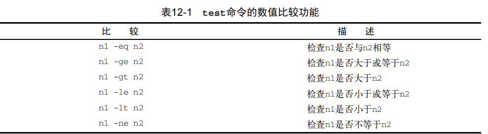
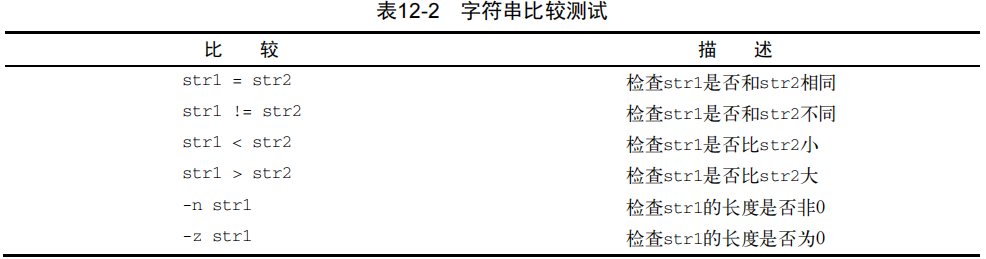
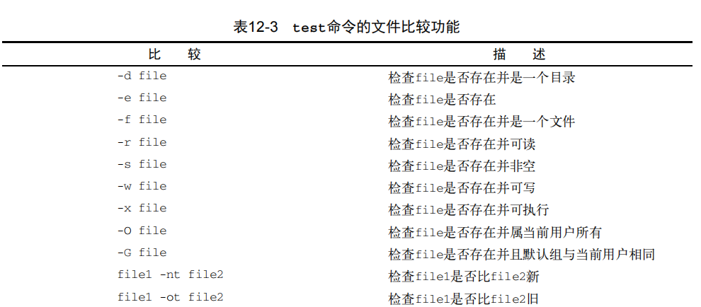
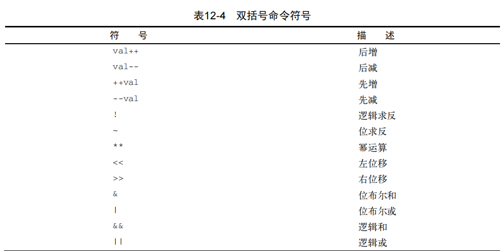

## 
- 每次登录Linux系统，bash shell都会访问/etc/profile启动文件以及3个针对每个用户的本地启动文件：$HOME/.bash_profile、$HOME/.bash_login和$HOME/.profile
## 命令
- `touch [fileName]` 创建文件
- `mkdir [fileName]` 创建目录
    - `-p` 创建嵌套目录
      - eg: `mkdir -p a/aa/aaa`
- `cp [source] [destination]` 复制文件或目录
    - `-i` 如果目标文件存在,询问是否需要覆盖已有文件
    - `-R` 递归地复制整个目录的内容
- `mv` 移动目录或文件
- `rm -rf [fielPath]` 强制删除目录或文件
- `file` 查看文件类型
- `cat` 查看文件
    - `-n` 显示行数
    - `-b` 有文本的行添加行号
- `less` 查看文件
- `tail` 查看文件(默认后10行)
    - `-f` 保持活动状态,并不断显示添加到文件中的内容
- `head` 查看文件(默认前10行)
    - `-f`
- `du` 显示当前目录下所有的文件、目录和子目录的磁盘使用情况，它会以磁盘块为单位来表明每个文件或目录占用了多大存储空间
    - `-c` 显示所有已列出文件总的大小
    - `-h` 按用户易读的格式输出大小，即用K替代千字节，用M替代兆字节，用G替代吉字节
    - `-s` 显示每个输出参数的总计
- `sort` 排序数据
    - `-n` 把数字当做字符来执行标准的字符排序
    - `-M` 按日期排序
    - `-reverse` 倒序
    - `-t` 指定字段分隔符
    - `-k` 指定排序的字段
- `grep` 搜索数据
    - `-v` 反向搜索
    - `-n` 显示行号
    - `-c` 匹配到的总行数
    - `-e` 指定每个匹配模式
        - eg: `grep -e 1 -e 0 a.txt`
- `tar -zxvf [fileName.tgz]` 解tgz格式的文件
- `ps` 显示进程
    - `-f` 显示PID和PPID
    - `--forest` 嵌套显示进程关系
- `top` 显示进程(动态的)
- `rpm -qa command` 查询命令十是否安装

## 创建全局变量

1. `echo $my` 先创建局部变量
2. `my="Hello"`
3. `export my` 将局部变量导出到全局变量
4. `unset my` 删除变量

:::tip 提示
在子shell中修改变量的值,不会影响到父shell,删除同理
:::

**交互式shell会去读取`$HOME/.bashrc`**<br/>
**非交互式shell会去读取`BASH_ENV`的环境变量**


## Linux文件权限
- `groupadd` 添加组
- `groupmod` 修改组
  - `-n` 修改组名
  - `-g` 修改GID
- `passwd` 修改密码

## 包管理
- `yum`
  - `[fileName]` 安装fileName文件
  - `localinstall package_name.rpm` 本地安装,手动下载rpm文件并用yum安装
  - `list installed` 已安装的包
  - `list updates` 列出需要跟新的包
  - `update [package_name]` 对指定的软件包更新
  - `update` 更新列表中所有的包
  - `remove [package_name]` 删除指定的包,保留包的数据和配置文件
  - `erase [package_name]` 删除指定的包,包括包的数据和配置文件
### 处理损坏的包依赖关系
1. 有时在安装多个软件包时，某个包的软件依赖关系可能会被另一个包的安装覆盖掉。这叫作损坏的包依赖关系,有时，只要清理了放错位置的文件就可以了
   - `yum clean all`
   - `yum update`
2. 这个命令显示了所有包的库依赖关系以及什么软件可以提供这些库依赖关系。一旦知道某个包需要的库，你就能安装它们了。
   - `yum deplist [package_name]`
3. 如果这样仍未解决问题，还有最后一招,--skip-broken选项允许你忽略依赖关系损坏的那个包，继续去更新其他软件包。这可能救不了损坏的包，但至少可以更新系统上的其他包。
   - `yum update --skip-broken`

## 脚本
```shell
# 赋值
# 第一种方式:
val=$($date)

# 第二种方式:
val=`date`

# 运算
total=$[ 1 * 2 ]

# if-then
if [] test
if (()) 高级数学表达式
if [[]] 高级字符串比较
```




